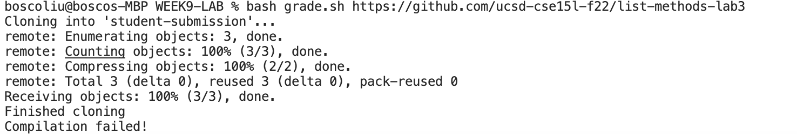
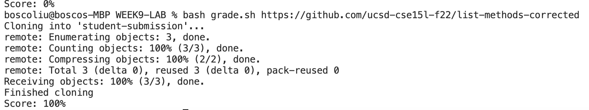
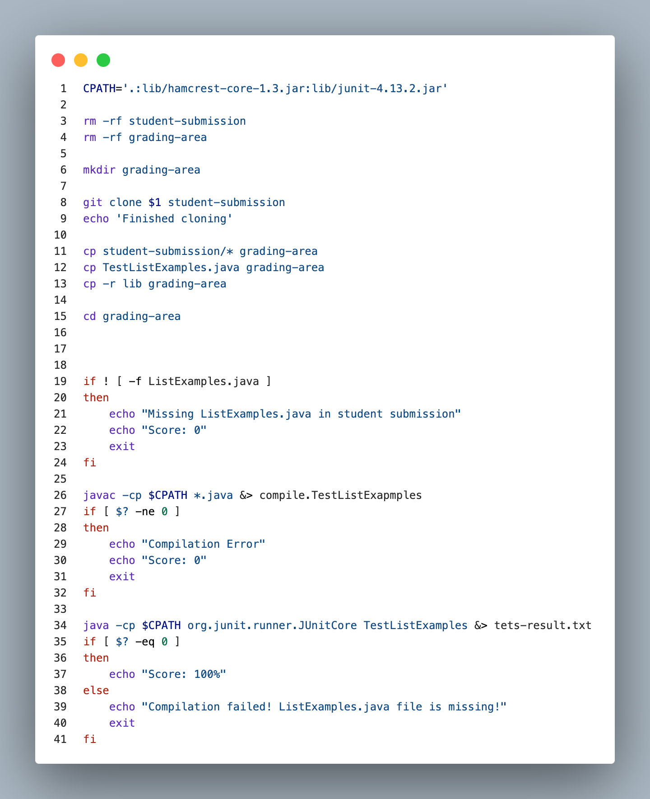
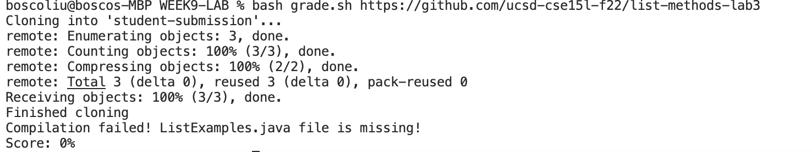

# Lab Report 5 - Putting it All Together (Week 9)
## Part 1 - Debugging Scenario
> [!WARNING]
> ### （Because I lost the screenshot of my classmate gave me, I need to recreate the question.）
Hello, recently I was working on an autograder bash script called `grade.sh` and I dont know why is didnt get "score 0". but my tested `https://github.com/ucsd-cse15l-f22/list-methods-corrected, which has the methods corrected (I would expect this to get full or near-to-full credit)` got 100%

Here is a screenshot of his output: 

Here's a screenshot of his bash script: 

### TA's Response

You don't need to change any code, but you can consider the missing `ListExamples.java` file.

### Student Response

I think the classmate's code is correct because he was able to change the score for the second link. I would consider this from ListExamples. Then when I modify lines 38-40 in grade.sh and add echo "Score 0", I can get the answer.

I tried running the bash script with the new classpath, and here's the output:

As shown, the command statement is missing.

### All setup information 

The working directory should have a WEEK9-lab folder with the necessary JUnit jar files, the tester file, the Java program, and the bash script. It should look similar to this: 
